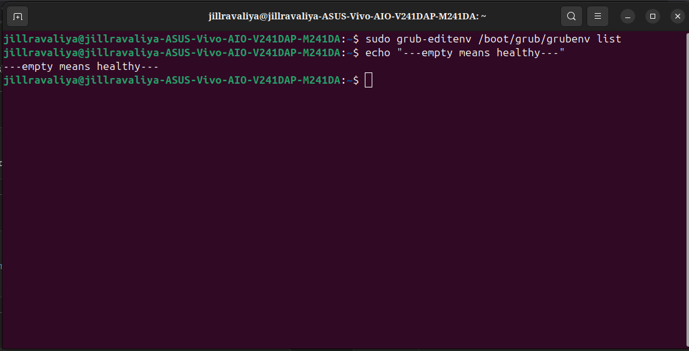
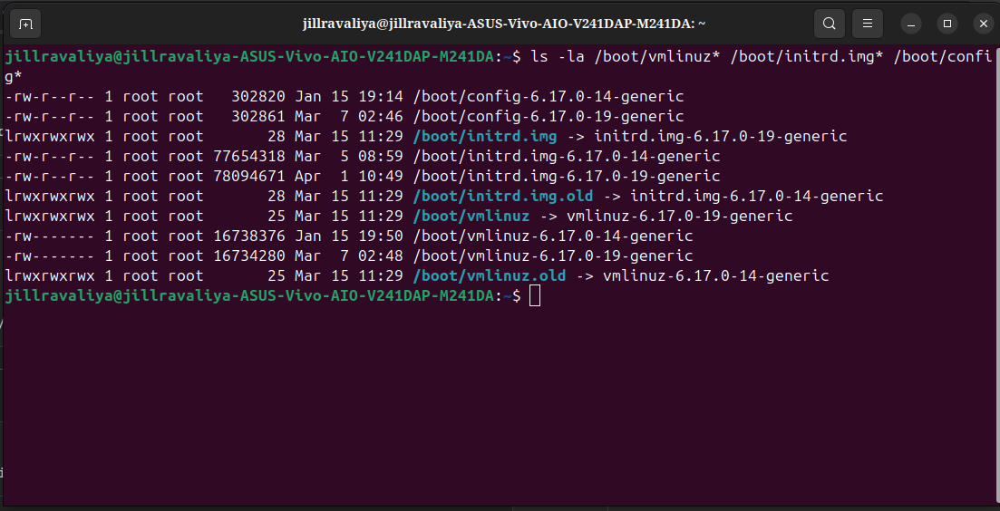
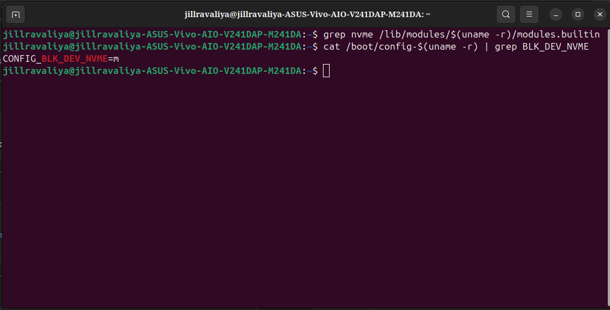
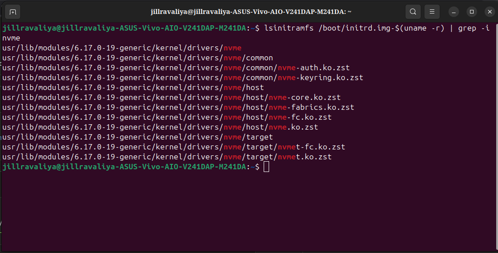
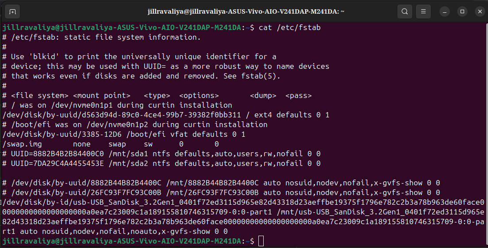
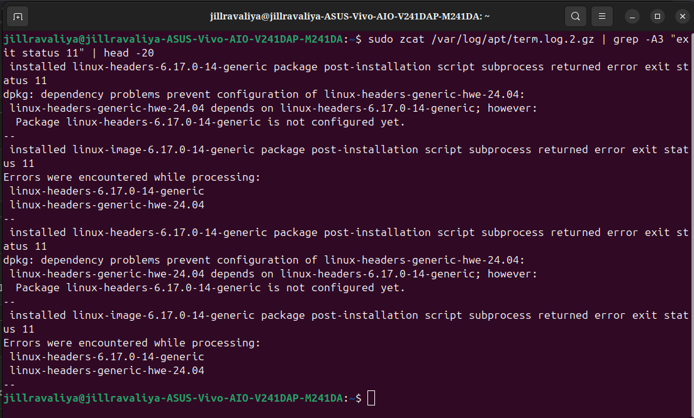
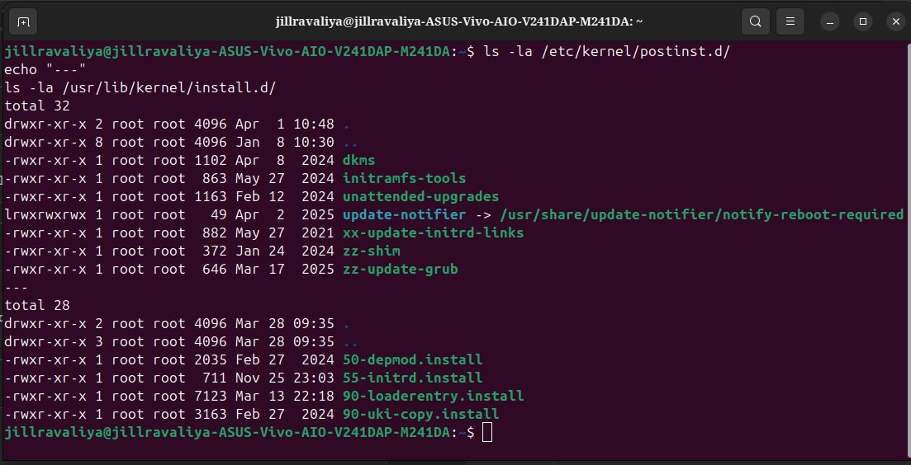
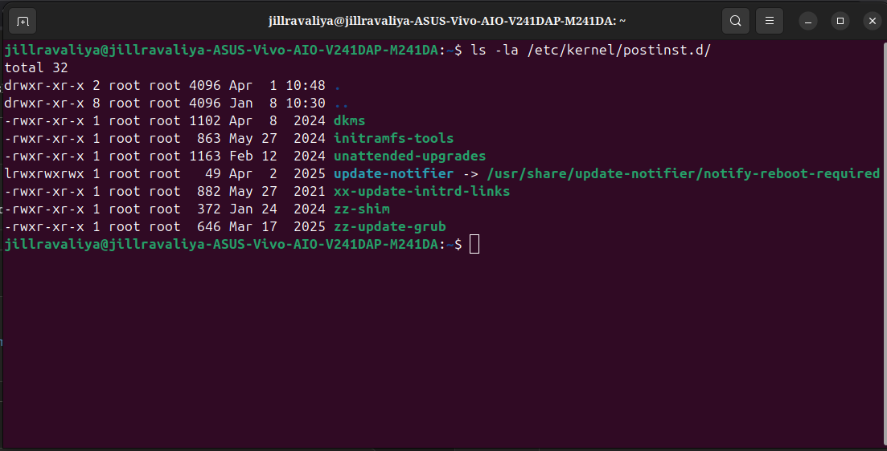
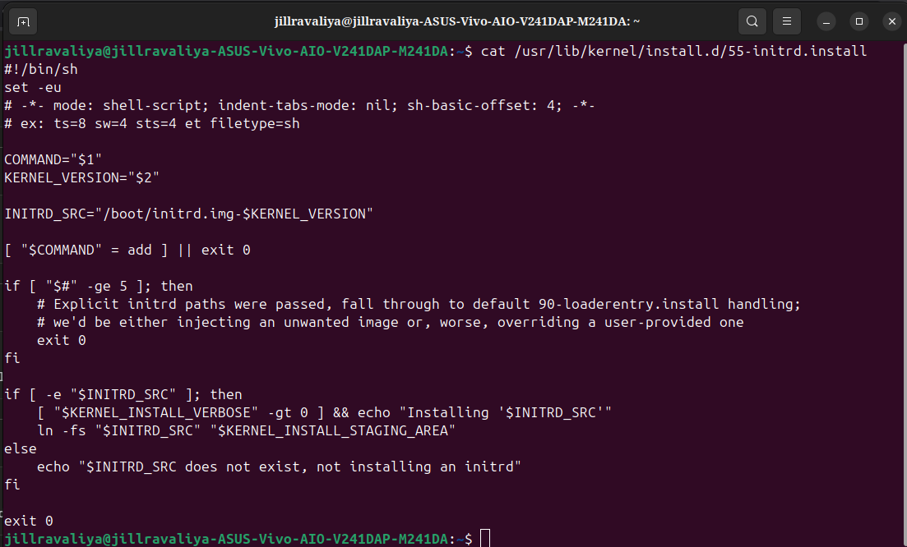
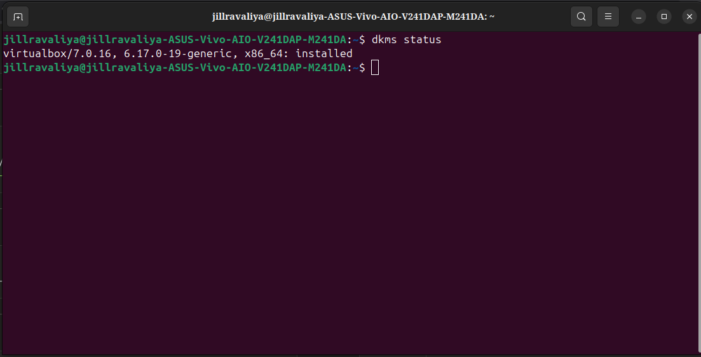

# One Missing File. Three Days of Silent Failures.

## A Note on This Document

This is a **reconstructed postmortem**, not a live incident log. The investigation happened across **February 11–13, 2026**. I collected dpkg logs, apt terminal logs, and boot journals throughout, then structured this afterward. The order reflects the logical progression of reasoning, not a precise chronological transcript.

---

## 1. Background — The Setup

**January 9, 2026** — completed the Linux Foundation's *"A Beginner's Guide to Linux Kernel Development"* (LFD103). Wanted to go further. Built a small character device driver — a kernel module that creates `/dev/jill`, handles blocking reads and writes using wait queues, and accepts IOCTL commands.

Kernel modules run in **Ring 0** — the most privileged CPU mode. A bad pointer dereference in Ring 0 crashes the entire system instantly with no recovery. No graceful exit. No catching it. Just a panic.

```
CPU Privilege Rings:

Ring 0 = kernel space
         full hardware access
         your kernel module runs here
         bad pointer → ENTIRE SYSTEM CRASHES instantly

Ring 3 = user space
         restricted access
         Chrome, Firefox run here
         bad pointer → just that program crashes
         kernel survives
```

To keep experiments safe, VirtualBox was installed and all kernel development happened inside a VM:

- If the kernel crashed, only the VM died
- The host stayed completely untouched
- All experiments isolated inside the virtual machine

That was the intent. The host did stay safe during experiments. But VirtualBox's presence on the host — registered with DKMS — quietly became a problem waiting to surface on the next kernel upgrade.

**DKMS** (Dynamic Kernel Module Support) is a system that automatically recompiles out-of-tree kernel modules on every kernel upgrade. When VirtualBox was installed, it registered itself with DKMS:

```
"Every time a new kernel is installed,
 recompile my kernel module for that kernel."
```

VirtualBox's module needs to match the running kernel exactly — this is called **vermagic** (version magic). A module compiled for kernel 6.14 cannot load on kernel 6.17. DKMS handles this recompilation automatically. Or it's supposed to.

---

## 2. The Panic

**February 13, 2026 — Morning**

Powered on. Instead of the login screen:


```
KERNEL PANIC!
Please reboot your computer.
VFS: Unable to mount root fs on unknown-block(0,0)
```

The host machine. The one never experimented on directly.

### Decoding the Error Message

Before anything else — understand what the error actually means:

```
VFS: Unable to mount root fs on unknown-block(0,0)

VFS = Virtual File System
      the kernel's abstraction layer over all filesystems
      sits between user programs and actual storage

root fs = the root filesystem = /
          the very FIRST mount the kernel makes
          absolutely everything depends on this
          if this fails, nothing can start

unknown-block(0,0):
  In Linux, every block device has two numbers:
  major number = which driver handles this device
  minor number = which specific device within that driver

  (8,0)   = /dev/sda    (SATA disk, first device)
  (8,1)   = /dev/sda1   (first partition of sda)
  (259,0) = /dev/nvme0n1 (NVMe disk, first namespace)
  (0,0)   = NO DEVICE EXISTS AT ALL
```

The kernel didn't fail to READ the disk. It couldn't SEE any disk. Completely invisible to the operating system. That distinction matters enormously — it points directly at a missing driver, not a corrupted filesystem.

### What Normally Happens vs What Happened

```
NORMAL BOOT:
GRUB → loads kernel + initrd into RAM
kernel starts → loads NVMe driver from initrd
NVMe driver → makes /dev/nvme0n1 appear
kernel reads /etc/fstab → finds UUID=d563d94d...
kernel mounts that UUID as /
systemd starts → full Linux running 

WHAT HAPPENED:
GRUB → loads kernel (no initrd — file missing!)
kernel starts → no NVMe driver available
no /dev/nvme0n1 appears (SSD completely invisible)
kernel tries to mount root filesystem
finds zero block devices
unknown-block(0,0) → KERNEL PANIC 
```

---

## 3. Recovery Through GRUB

Powered off, powered back on. Interrupted automatic boot, opened the GRUB menu:


Two options:
- `Ubuntu, with Linux 6.17.0-14-generic` ← just panicked
- `Ubuntu, with Linux 6.14.0-37-generic` ← previous kernel

Selected `6.14`. Desktop appeared normally.

GRUB always selects the newest kernel by default — `6.17 > 6.14` numerically. Every automatic reboot would go straight back to the panic without manual intervention.

**Why GRUB showed a 30-second menu instead of auto-booting:**

GRUB has a built-in recovery mechanism called `recordfail`. Every time GRUB starts loading a kernel, it saves `recordfail=1` to its memory file (grubenv) **before** the kernel even starts. If the kernel boots successfully, Linux clears this variable. If the kernel crashes, the variable stays set.

```
Panic boot:
  GRUB saves recordfail=1 → starts loading kernel
  kernel panics → recordfail=1 stays saved

Next boot:
  GRUB reads recordfail=1 from grubenv
  "last boot failed!"
  → shows menu for 30 seconds instead of 10
  → gives time to select different kernel
```

After full recovery, grubenv is empty — no failed boots recorded:



---

## 4. The First Clue — A Symlink Pointing at Nothing

Once on the working kernel:

```bash
uname -r
# 6.14.0-37-generic

ls -la /boot/initrd*
```


```
lrwxrwxrwx  initrd.img → initrd.img-6.17.0-14-generic   (Feb 13 08:41)
-rw-r--r--  initrd.img-6.14.0-37-generic   73101720 bytes  ← real file 
lrwxrwxrwx  initrd.img.old → initrd.img-6.14.0-37-generic
```

The symlink `initrd.img` pointed to `initrd.img-6.17.0-14-generic`. That target file did not exist anywhere on the system.

```
Symlink: initrd.img ──────→ initrd.img-6.17.0-14-generic
                                        ↑
                                 FILE DOES NOT EXIST
                                 never created
                                 pointer to nothing
```

Current state of boot files (proof-08-boot-files.txt):



```
/boot/initrd.img-6.17.0-14-generic   77654318 bytes  ← now exists (manually created)
/boot/initrd.img-6.17.0-19-generic   78094671 bytes  ← current kernel's initrd
```

Both initrd files exist now because the missing one was manually created during recovery. During the panic, the first file didn't exist at all.

### What initrd Actually Is

initrd = initial RAM disk. A compressed archive (~77MB) that GRUB loads into RAM alongside the kernel.

```
GRUB loads two things into RAM before starting kernel:
1. vmlinuz  (the kernel binary, ~16MB compressed)
2. initrd.img (a complete mini-filesystem, ~77MB compressed)

Inside initrd.img is a tiny temporary Linux system:
├── bin/         (busybox - one binary pretending to be 200 commands)
├── lib/modules/ (kernel modules - specifically the drivers needed to find the real /)
│   └── 6.17.0-14-generic/
│       └── drivers/
│           └── nvme/
│               ├── nvme-core.ko.zst  ← THE CRITICAL FILE
│               └── nvme.ko.zst       ← THE CRITICAL FILE
├── scripts/     (boot scripts that find and mount real /)
└── init         (first program that runs)
```

The kernel mounts this mini-filesystem in RAM, runs the init script which loads drivers and finds the real disk, then discards the entire initrd and hands control to the real Linux system.

### The Chicken-and-Egg Problem initrd Solves

```
WITHOUT initrd — the paradox:
┌─────────────────────────────────────────┐
│ kernel: "I need to read /lib/modules/   │
│          to find the NVMe driver"       │
│ SSD:    "I'm here! But you need NVMe    │
│          driver to talk to me!"         │
│ kernel: "I need the driver to find you" │
│ SSD:    "You need to find me to get it" │
│         ← infinite deadlock → PANIC     │
└─────────────────────────────────────────┘

WITH initrd — the solution:
┌─────────────────────────────────────────┐
│ GRUB loads initrd into RAM              │
│ (RAM is accessible with zero drivers)   │
│ kernel: "I'll get the driver from RAM!" │
│ loads nvme-core.ko from initrd in RAM   │
│ loads nvme.ko from initrd in RAM        │
│ NVMe driver now active!                 │
│ SSD becomes visible                     │
│ kernel mounts real / from SSD           │
│ discards initrd from RAM                │
│ full Linux runs                         │
└─────────────────────────────────────────┘
```

initrd exists specifically because RAM needs no driver to access. The driver travels to the kernel via RAM, not via the disk it needs to control. Without initrd, the SSD remains permanently invisible.

---

## 5. Why NVMe Systems Specifically

Checked the kernel configuration — the file recording every decision made when the kernel was compiled:


From `proof-03-nvme-config.txt`:

```
CONFIG_BLK_DEV_INITRD=y
CONFIG_INITRAMFS_SOURCE=""
CONFIG_BLK_DEV_NVME=m
CONFIG_ATA=y
--- above empty = nvme NOT built in ---
```



These four lines explain everything:

```
CONFIG_BLK_DEV_NVME=m

=m means MODULE
   The NVMe driver is NOT compiled into vmlinuz
   It exists as a separate .ko.zst file
   Must be explicitly loaded at boot time
   The only way to load it early enough = initrd

CONFIG_ATA=y

=y means BUILT IN (yes, always)
   SATA driver IS compiled into vmlinuz itself
   Always present from the first instruction
   SATA systems don't need initrd for storage

CONFIG_BLK_DEV_INITRD=y
   Kernel can accept an external initrd 
   But has nothing embedded by default

CONFIG_INITRAMFS_SOURCE=""
   Empty = nothing embedded inside kernel binary
   Must get initrd from GRUB externally
```

This explains why the same bug affects only some systems:

```
NVMe system (like this one):
  Storage driver = module (=m) → lives in initrd
  No initrd = no driver = no SSD visible = PANIC

SATA system:
  Storage driver = built-in (=y) → inside vmlinuz
  No initrd = driver already there = SSD visible = BOOTS FINE

Same bug, completely different result depending on storage type.
SATA users would never notice this failure.
```

Confirmed: NVMe drivers exist ONLY inside initrd, nowhere on disk:

```bash
lsinitramfs /boot/initrd.img-$(uname -r) | grep -i nvme
```



From `proof-04-initrd-contents.txt`:

```
usr/lib/modules/6.17.0-19-generic/kernel/drivers/nvme/host/nvme-core.ko.zst
usr/lib/modules/6.17.0-19-generic/kernel/drivers/nvme/host/nvme.ko.zst
usr/lib/modules/6.17.0-19-generic/kernel/drivers/nvme/host/nvme-fabrics.ko.zst
usr/lib/modules/6.17.0-19-generic/kernel/drivers/nvme/host/nvme-fc.ko.zst
usr/lib/modules/6.17.0-19-generic/kernel/drivers/nvme/common/nvme-auth.ko.zst
usr/lib/modules/6.17.0-19-generic/kernel/drivers/nvme/common/nvme-keyring.ko.zst
```

`.ko.zst` = kernel object, zstandard compressed. The kernel decompresses these when loading. Without initrd carrying them, the kernel starts with zero NVMe support and zero visibility of the SSD.

### The fstab Connection

When the kernel panicked, this is what it was trying to satisfy:

```bash
cat /etc/fstab
```



```
UUID=d563d94d-89c0-4ce4-99b7-39382f0bb311  /  ext4  defaults  0  1
```

Kernel reads fstab, sees: "mount the partition with UUID d563d94d as /". To find that UUID, it scans all block devices. To see any block devices, it needs the NVMe driver. NVMe driver was supposed to come from initrd. initrd didn't exist.

Zero block devices found → unknown-block(0,0) → panic.

The same UUID appears in four places:
- `/etc/fstab` (kernel mounts /)
- `/boot/grub/grub.cfg` (GRUB loads kernel from here)
- `/boot/efi/EFI/ubuntu/grub.cfg` (tiny pointer file)
- `/var/log/kern.log` (kernel confirms mount on healthy boots)

One UUID, referenced at every stage of the boot process. When the NVMe driver is missing, that UUID can never be found.

---

## 6. Reading the Logs — The Three-Day Pattern

Ubuntu generates the initrd automatically during kernel installation. Something went wrong. Checked the dpkg log — dpkg is the low-level package manager that records every install, remove, and configure event:

```bash
sudo cat /var/log/dpkg.log | grep "6.17.0-14" | grep "half-configured\|trigproc"
```


From `proof-01-dpkg-timeline.txt`:

```
Feb 11 09:09:25  status half-configured  linux-image-6.17.0-14-generic
Feb 11 09:09:32  trigproc               linux-image-6.17.0-14-generic
Feb 11 09:09:32  status half-configured  linux-image-6.17.0-14-generic

Feb 12 09:36:03  trigproc               linux-image-6.17.0-14-generic
Feb 12 09:36:03  status half-configured  linux-image-6.17.0-14-generic

Feb 13 08:41:13  trigproc               linux-image-6.17.0-14-generic
Feb 13 08:41:13  status half-configured  linux-image-6.17.0-14-generic
```

Three days. Same failure. Zero user-visible output.

**What these states mean:**

```
dpkg package states (in order):

install         → package installation starting
half-installed  → files being copied to disk
unpacked        → files copied, not yet configured
half-configured → configuration STARTED but FAILED ← STUCK HERE
installed       → fully installed 
triggers-pending → post-install triggers queued for later
trigproc        → trigger being processed (retry attempt)
```

**The trigger retry mechanism:**

When configuration fails, dpkg doesn't give up. It queues a trigger — "try again next time apt runs." Each day when apt ran (checking for updates, background maintenance), dpkg saw the pending trigger and retried. Each retry hit the same failure. Each time, silently.

The apt terminal log captures what dpkg log doesn't — the actual error output:

```bash
sudo zcat /var/log/apt/term.log.2.gz | grep -A3 "exit status 11"
```



From `proof-02-dkms-failure.txt`:

```
* dkms: autoinstall for kernel 6.17.0-14-generic
   ...fail!
run-parts: /etc/kernel/postinst.d/dkms exited with return code 11

dpkg: error processing package linux-image-6.17.0-14-generic (--configure):
 installed post-installation script returned error exit status 11

Errors were encountered while processing:
 linux-headers-6.17.0-14-generic      ← failed (root cause)
 linux-headers-generic-hwe-24.04      ← failed (depends on above)
 linux-generic-hwe-24.04              ← failed (depends on above)
 linux-image-6.17.0-14-generic        ← failed (separate dkms run)

Log ended: 2026-02-11 09:09:34
Log started: 2026-02-12 09:35:56
...identical failure...
Log ended: 2026-02-12 09:36:05
Log started: 2026-02-13 08:41:04
...identical failure...
Log ended: 2026-02-13 08:41:15
```

One package failure cascaded into four packages broken. Three separate apt sessions across three days. Same result each time.

---

## 7. Two Systems, Two Failures

When a new kernel installs on Ubuntu, two completely independent systems run:



```
SYSTEM 1: dpkg/apt postinst
─────────────────────────────────────────────
Location: /etc/kernel/postinst.d/
Tool:     run-parts
Order:    ALPHABETICAL
Failure:  STOPS on first non-zero exit code
Job:      build initrd, update GRUB, compile DKMS modules
─────────────────────────────────────────────

SYSTEM 2: kernel-install (systemd)
─────────────────────────────────────────────
Location: /usr/lib/kernel/install.d/
Tool:     kernel-install
Order:    NUMERICAL (50, 55, 90...)
Failure:  CONTINUES regardless of individual failures
Job:      register kernel with boot infrastructure
─────────────────────────────────────────────
```

These two systems are completely independent. They don't know about each other's failures. This independence is normally fine — but here it created a gap that a silent failure could fall through.

---

## 8. System 1 — The Alphabetical Trap

```bash
ls -la /etc/kernel/postinst.d/
```



From `proof-06-postinst-order.txt`:

```
dkms                  ← d = FIRST
initramfs-tools       ← i = SECOND
unattended-upgrades   ← u = THIRD
update-notifier       ← symlink
xx-update-initrd-links
zz-shim
zz-update-grub        ← zz = LAST (intentional design)
```

`run-parts` executes these in strict alphabetical order. The naming is intentional — `zz-update-grub` starts with `zz` precisely so it runs after everything else is ready. GRUB needs to know where the initrd is before writing its config.

**The key behavior:** `run-parts` stops completely on the first non-zero exit code. One failure = everything after it never runs.

### What the dkms script does

```bash
# /etc/kernel/postinst.d/dkms (simplified core logic)
inst_kern=$1   # = "6.17.0-14-generic"

if [ -x /usr/lib/dkms/dkms_autoinstaller ]; then
    exec /usr/lib/dkms/dkms_autoinstaller start "$inst_kern"
fi
```

`exec` replaces the current process. If `dkms_autoinstaller` fails, this script's exit code equals dkms_autoinstaller's exit code. dkms_autoinstaller found VirtualBox registered and tried to compile it:

```
Build command:
make -j2 KERNELRELEASE=6.17.0-14-generic \
    -C /lib/modules/6.17.0-14-generic/build \
    M=/var/lib/dkms/virtualbox/7.0.16/build

Result from the compiler:
fatal error: VBox/cdefs.h: No such file or directory
   47 | #include <VBox/cdefs.h>
compilation terminated.
make: bad exit status: 2
dkms_autoinstaller: exit code 11
```


**Why VBox/cdefs.h was missing:**

```
VirtualBox on Ubuntu comes as:
virtualbox-7.0.16-dfsg-2ubuntu1.1

dfsg = Debian Free Software Guidelines
Ubuntu modified VirtualBox to comply with open-source requirements.
In doing so, they removed proprietary components.
VBox/cdefs.h was among the removed files.

VBox/cdefs.h contains type definitions that
VirtualBox's kernel module source code depends on.
Without it, the C compiler cannot compile the module:
"I don't know what VBox_DECL means" → compilation terminated

The package registered with DKMS to compile on every kernel upgrade
but couldn't actually compile — missing its own source files.
This failure would have occurred on ANY kernel upgrade since
VirtualBox was installed.
```

**run-parts received exit 11. It stopped. Everything after dkms never ran:**

```
[d] dkms              → exit 11! STOP!
[i] initramfs-tools   → NEVER STARTED ← THE CRITICAL VICTIM
[u] unattended...     → NEVER STARTED
[xx] xx-update-...    → NEVER STARTED
[zz] zz-shim          → NEVER STARTED
[zz] zz-update-grub   → NEVER STARTED via run-parts
```

### What initramfs-tools would have done

```bash
# /etc/kernel/postinst.d/initramfs-tools (the critical line)
update-initramfs -c -k "${version}"
# version = "6.17.0-14-generic"
```

`update-initramfs` reads `/etc/initramfs-tools/initramfs.conf`:

```
MODULES=most     ← include most available drivers (why initrd = 77MB)
COMPRESS=zstd    ← compress with zstandard algorithm
BUSYBOX=auto     ← include emergency shell for boot failures
```

It would have gathered NVMe drivers, packaged them into a compressed archive, and written the result to `/boot/initrd.img-6.17.0-14-generic`. This file would have been 77MB. It was never created. The symlink was updated to point at it. But the file itself: never existed.

---

## 9. System 2 — The Silent Lie

While System 1 was stopped by dkms, System 2 (kernel-install) ran independently and reached the script at the center of the bug:

```bash
cat /usr/lib/kernel/install.d/55-initrd.install
```



From `proof-05-buggy-script.txt`:

```bash
#!/bin/sh
set -eu

COMMAND="$1"           # = "add" (adding a kernel)
KERNEL_VERSION="$2"    # = "6.17.0-14-generic"

INITRD_SRC="/boot/initrd.img-$KERNEL_VERSION"
# expands to: "/boot/initrd.img-6.17.0-14-generic"

[ "$COMMAND" = add ] || exit 0   # is "add" → continue

if [ "$#" -ge 5 ]; then
    # Explicit initrd paths were passed
    exit 0
fi

if [ -e "$INITRD_SRC" ]; then
    [ "$KERNEL_INSTALL_VERBOSE" -gt 0 ] && echo "Installing '$INITRD_SRC'"
    ln -fs "$INITRD_SRC" "$KERNEL_INSTALL_STAGING_AREA"
else
    echo "$INITRD_SRC does not exist, not installing an initrd"
    # During apt upgrade, KERNEL_INSTALL_VERBOSE=0
    # This line never printed. Complete silence.
fi

exit 0   ← THE BUG
         #  This is line 26.
         #  Always returns "success."
         #  Regardless of what happened above.
         #  Whether initrd exists or not.
```


**Step by step what happened when this script ran:**

```
Script runs with:
  COMMAND = "add"
  KERNEL_VERSION = "6.17.0-14-generic"
  INITRD_SRC = "/boot/initrd.img-6.17.0-14-generic"

Check: is COMMAND "add"? Yes → continue

Check: does /boot/initrd.img-6.17.0-14-generic exist?
Answer: NO — System 1 never created it

else branch runs:
  echo "...does not exist, not installing an initrd"
  KERNEL_INSTALL_VERBOSE = 0 (apt's default)
  nothing printed to terminal
  user sees nothing

exit 0
  Returns "success" to the entire kernel install chain
  dpkg receives: "everything went fine"
  GRUB config will be generated
  Boot entry will be created
  System appears fully updated and ready to reboot
```

**Exit code 0 is a contract.** It means: "everything I was responsible for succeeded." When 55-initrd.install returned exit 0 with no initrd present, it broke that contract. Every system downstream trusted the promise.

**The one-line fix:**

```bash
# Current (buggy):
else
    echo "$INITRD_SRC does not exist, not installing an initrd"
fi
exit 0  ← always success

# Fixed:
else
    echo "$INITRD_SRC does not exist, not installing an initrd" >&2
    exit 1  ← report failure, stop the lie
fi
exit 0  ← only reached when initrd exists
```

With exit 1, dpkg marks the package half-configured (visible!), apt reports an error (visible!), GRUB does not create a boot entry for an incomplete installation, and the user has a chance to fix the problem before rebooting.

---

## 10. The Mystery of Days 1 and 2 — Solved

A question that needed answering: if 6.17.0-14 was installed with a broken initrd on Feb 11, why did Feb 11 and Feb 12 reboots work fine?

The answer was hidden in `proof-02-dkms-failure.txt`, specifically the Feb 13 session:

```
Log started: 2026-02-13 08:41:04

Removing linux-image-6.14.0-36-generic (6.14.0-36.36~24.04.1) ...

/etc/kernel/postrm.d/initramfs-tools:
update-initramfs: Deleting /boot/initrd.img-6.14.0-36-generic

/etc/kernel/postrm.d/zz-update-grub:
Sourcing file `/etc/default/grub'
Generating grub configuration file ...
```

On Feb 13 morning, apt was removing an old kernel (`6.14.0-36`). When a kernel is removed, `postrm.d` scripts run — specifically `zz-update-grub`, which **regenerated grub.cfg**.

```
Feb 11 and Feb 12:
  grub.cfg not yet updated to boot 6.17.0-14 by default!
  zz-update-grub never ran via run-parts (dkms stopped it)
  GRUB was still pointing to 6.14.0-37 as default
  reboots loaded old kernel
  old kernel had valid initrd
  everything worked normally
  ← this is why day 1 and 2 felt completely normal

Feb 13 08:41:
  apt removed old kernel 6.14.0-36 (routine cleanup)
  postrm.d/zz-update-grub ran (removing old kernel triggers this!)
  grub.cfg was fully regenerated
  6.17.0-14 = newest installed kernel → becomes default!
  grub.cfg now says: boot 6.17.0-14-generic
  initrd for 6.17.0-14 = still missing!

Feb 13 — next reboot:
  GRUB default = 6.17.0-14
  loads vmlinuz-6.17.0-14-generic 
  tries to load initrd.img-6.17.0-14-generic does not exist
  kernel starts without NVMe driver
  SSD invisible
  KERNEL PANIC
```

The panic didn't happen on day 1 or day 2 because grub.cfg hadn't yet been updated to boot the broken kernel. It happened on day 3 because removing a different old kernel triggered a grub rebuild that finally promoted 6.17.0-14 to default — with no initrd behind it.

**Also visible in the dpkg timeline:** Feb 14 shows full recovery:

```
Feb 14 16:22:00  configure linux-image-6.17.0-14   ← manual fix
Feb 14 16:22:04  status installed                   
Feb 14 16:22:04  linux-headers-6.17.0-14 installed  
Feb 14 16:22:04  linux-headers-generic installed     
Feb 14 16:22:10  status installed                  ← everything clean
```

After removing VirtualBox and manually running `update-initramfs`, the package finally configured successfully.

---

## 11. The Bug Discussion — Where It Gets Deeper

Filed against the systemd package as Bug #2141741. The discussion that followed reveals a deeper disagreement about where the real fix belongs.


Within 2 hours of filing, Ubuntu developers confirmed the report. Status: New → Confirmed.

### The Proposed Fix (Daniel Letzeisen, Comment #3)

```bash
# Cleaner version of the fix:
if [ -e "$INITRD_SRC" ]; then
    ln -fs "$INITRD_SRC" "$KERNEL_INSTALL_STAGING_AREA"
    exit 0   ← success only when initrd actually exists
else
    echo "$INITRD_SRC does not exist, not installing an initrd" >&2
    exit 1   ← fail when initrd is missing
fi
```

Moving `exit 0` into the success branch ensures exit 1 is only reached when something actually went wrong.

### Nick Rosbrook's Pushback (Ubuntu systemd maintainer, Comment #5)

> *"I am not sure this is the right place to fix this. Strictly speaking, an initrd is not required in all setups or contexts which this script might be called from. Hence, the current behavior."*

Nick raised a technically valid concern. The script has no context about whether initrd is actually needed:

```
NVMe system (like this one):
  CONFIG_BLK_DEV_NVME=m
  NVMe driver = module = must come from initrd
  initrd missing = catastrophic → PANIC
  → exit 1 is correct here

SATA system:
  CONFIG_ATA=y
  SATA driver = built into kernel
  initrd missing = harmless, system boots fine
  → exit 1 would BREAK their kernel install for no reason

Embedded/IoT systems (everything compiled =y):
  no modules, no initrd ever needed
  → exit 1 would break every kernel install

Container environments:
  don't boot at all
  initrd irrelevant
  → exit 1 = wrong behavior
```

The script cannot distinguish between "initrd missing because something failed" and "initrd missing because it's not needed." A blind `exit 1` fixes NVMe systems while potentially breaking others.

### The "Defense in Depth" Response

Nick's point is valid. So is the counterargument:

> *"Yes, DKMS should fail harder (that's Bug #2136499). But 55-initrd.install should ALSO fail when it detects missing initrd. That's defense in depth."*
>
> *"The script already detects the problem (the else branch runs). It just returns the wrong exit code. exit 0 instead of exit 1."*

Defense in depth = multiple independent safety nets. If the first net fails, the second catches it. The script already knows something went wrong — it just refuses to say so.

### What the Complete Fix Looks Like

Nick's concern reveals that the real fix needs context the script doesn't currently have:

```bash
# What's actually needed — context-aware failure:
if [ -e "$INITRD_SRC" ]; then
    ln -fs "$INITRD_SRC" "$KERNEL_INSTALL_STAGING_AREA"
    exit 0
else
    # Not just blindly exit 1
    # First: does this system actually need initrd?
    if kernel_requires_initrd "$KERNEL_VERSION"; then
        echo "ERROR: initrd required but missing for $KERNEL_VERSION" >&2
        exit 1   ← fail only when initrd is actually needed
    else
        echo "initrd not present and not required on this system"
        exit 0   ← safe for SATA, embedded, containers
    fi
fi

# kernel_requires_initrd could check:
# grep "CONFIG_BLK_DEV_NVME=m" /boot/config-$KERNEL_VERSION
# grep "CONFIG_ATA=y" /boot/config-$KERNEL_VERSION
# any critical storage driver is =m → needs initrd
```

### Nick's Bigger Fix (Comment #10)

> *"I really think the kernel packaging should handle all of this. If any of the run-parts scripts in /etc/kernel/postinst.d/ fail, the package installation should probably fail/stop."*

```
Layer 1 (kernel packaging — Nick's fix):
  if ANY postinst script fails
  → kernel package installation HARD FAILS visibly
  → apt shows error to user before any reboot
  → user sees: "ERROR: kernel install failed, don't reboot!"
  → never reaches the initrd problem

Layer 2 (55-initrd.install — original fix):
  even if layer 1 misses something
  → 55-initrd.install detects missing initrd
  → returns exit 1 when initrd is needed
  → second independent safety net

Both layers needed. One unrelated failure (VirtualBox compilation)
should not be able to silently create an unbootable system.
```

Nick moved the bug to the kernel team. Both layers need fixing. Neither has been fully addressed yet.

### Current Bug Status

```
Bug #2141741 (the real bug — silent exit 0):
  systemd (Ubuntu) → Incomplete
                     Nick not convinced about 55-initrd fix alone
                     
  linux (Ubuntu)   → Confirmed 
                     kernel team now owns it

March 24, 2026:
  Ubuntu Kernel Bot added: kernel-daily-bug
  = on Ubuntu kernel team's daily monitoring list
  = actively tracked, reviewed regularly
  = not forgotten

The underlying issue — 55-initrd.install returning exit 0
when initrd is missing — is still present in the codebase.
```

---

## 12. Bug #2136499 — The Trigger Gets Fixed

While the underlying issue in 55-initrd.install is still being addressed, the trigger that caused the failure on this system has been fixed.

Bug #2136499: `virtualbox-dkms FTBFS in Noble with the linux-6.17 kernel`
- Originally reported December 16, 2025
- Eventually affected 224+ users
- Hundreds of duplicate bug reports filed

The fix required significant work — Ubuntu's virtualbox package was months behind upstream, and multiple kernel API changes in Linux 6.15, 6.16, and 6.17 had broken the build. John Cabaj from Canonical applied 13 separate patches:

```
virtualbox (7.0.16-dfsg-2ubuntu1.3) noble; urgency=medium

  * Further patches for Linux 6.17 kernel support (LP: #2136499)
    - 46-Additions-Linux-vboxvideo-Fix-building-issues-with-k.patch
    - 47-Additions-Linux-vboxfs-Fix-building-issues-with-kern.patch
    - 48-Linux-host-vboxdrv-Introduce-initial-support-for-ker.patch
    - 49-Additions-Linux-vboxsf-Align-with-upstream-vboxsf-ch.patch
    - 50-Additions-Linux-vboxvideo-Additional-fixes-for-kerne.patch
    - 51-Additions-Linux-vboxsf-Add-initial-support-for-kerne.patch
    - 52-vboxdrv-Introduce-initial-support-for-kernel-6.16-bu.patch
    - 53-Additions-Linux-vboxsf-More-fixes-for-kernel-6.16-bu.patch
    - 54-HostDrivers-Support-bugref-10963-Use-the-host-kernel.patch
    - 55-netflt-Linux-Introduce-initial-support-for-kernel-6..patch
    - 56-Additions-Linux-vboxvideo-Introduce-initial-support-.patch
    - 57-Additions-Linux-vboxsf-Introduce-initial-support-for.patch
    - 58-Additions-Linux-vboxvideo-Initial-support-for-kernel.patch

 -- John Cabaj <john.cabaj@canonical.com> Wed, 11 Mar 2026
```

Released to Ubuntu Noble updates: March 23, 2026.

After the fix, VirtualBox DKMS now compiles successfully for kernel 6.17.0-19:

```bash
dkms status
```



```
virtualbox/7.0.16, 6.17.0-19-generic, x86_64: installed 
```

The trigger is fixed. The underlying issue (55-initrd.install exit 0) remains open.

**The important distinction:**

The VirtualBox fix means this specific failure chain won't repeat for VirtualBox users. But the underlying systemd behavior means that **any** DKMS module failure on an NVMe system can still produce an unbootable system silently:

```
NVIDIA driver fails to compile   → same path → same potential panic
ZFS module fails to compile      → same path → same potential panic
WireGuard fails to compile       → same path → same potential panic
any DKMS module fails            → same path → same potential panic
```

Until 55-initrd.install is fixed or kernel packaging adds better failure handling, the vulnerability remains for any DKMS-registered module that fails to compile.

---

## 13. Complete Failure Chain

```
Ubuntu ships virtualbox-7.0.16-dfsg
  VBox/cdefs.h removed for DFSG compliance
  Package registers with DKMS on installation:
  "recompile my module on every kernel upgrade"
    ↓
Feb 11, 09:07 — apt upgrade
kernel 6.17.0-14 package files land in /boot:
  vmlinuz-6.17.0-14-generic      ✅ installed
  config-6.17.0-14-generic       ✅ installed
  System.map-6.17.0-14-generic   ✅ installed
  initrd.img-6.17.0-14-generic   ← NEVER CREATED
    ↓
run-parts starts /etc/kernel/postinst.d/ alphabetically:

[d] dkms runs:
    dkms_autoinstaller start 6.17.0-14-generic
    finds virtualbox/7.0.16 registered
    runs: make -j2 KERNELRELEASE=6.17.0-14-generic ...
    fatal error: VBox/cdefs.h: No such file or directory
    make exits 2 → dkms exits 11

run-parts receives exit 11 → STOPS

[i] initramfs-tools   → NEVER RAN
    update-initramfs  → NEVER CALLED
    initrd            → NEVER CREATED

[zz] zz-update-grub   → NEVER RAN via run-parts
    ↓
kernel-install (systemd) runs independently:

[55] 55-initrd.install:
     INITRD_SRC = /boot/initrd.img-6.17.0-14-generic
     Check: file exists? NO
     Print: nothing (KERNEL_INSTALL_VERBOSE=0 during apt)
     Return: exit 0 ← THE LIE
    ↓
Feb 11 and Feb 12:
  grub.cfg not yet updated (zz-update-grub never ran via run-parts)
  GRUB still points to old kernel as default
  reboots load old kernel with valid initrd
  everything seems normal ← the silence is deceptive
    ↓
Feb 13, 08:41:
  apt removes old kernel 6.14.0-36 (routine cleanup)
  postrm.d/zz-update-grub runs (triggered by kernel REMOVAL)
  grub.cfg regenerated
  6.17.0-14 = newest kernel = new default
  grub.cfg points to:
    linux  /boot/vmlinuz-6.17.0-14-generic    ✅ exists
    initrd /boot/initrd.img-6.17.0-14-generic ❌ missing
    ↓
Feb 13 — reboot

GRUB loads vmlinuz-6.17.0-14-generic     ✅
GRUB tries initrd.img-6.17.0-14-generic  ❌ not found

kernel starts without initrd
no nvme-core.ko (CONFIG_BLK_DEV_NVME=m, not =y)
no nvme.ko
SSD completely invisible
    ↓
kernel reads /etc/fstab:
  mount UUID=d563d94d-89c0-4ce4-99b7-39382f0bb311 as /
  scans all block devices for that UUID
  finds zero block devices (no NVMe driver = no /dev/nvme*)
    ↓
VFS: Unable to mount root fs on unknown-block(0,0)
KERNEL PANIC
```

---

## 14. How to Read These Logs

The failure was logged at info level, not error level. `grep -i error` would have found almost nothing useful. The chain became visible only by reading the full sequence and noting what was **absent**, not what was present.

```bash
# Step 1: Find the pattern — half-configured three days in a row
sudo cat /var/log/dpkg.log | grep "6.17.0-14" | grep "half-configured"
# → reveals: something failed during postinst, repeatedly

# Step 2: Find the cause — what failed during postinst
sudo zcat /var/log/apt/term.log.2.gz | grep -C5 "exit status 11"
# → reveals: dkms failed with exit 11

# Step 3: Find the missing file
ls -la /boot/initrd*
# → reveals: symlink points to nonexistent file

# Step 4: Understand why this is catastrophic for NVMe
cat /boot/config-6.17.0-14-generic | grep BLK_DEV_NVME
# → reveals: CONFIG_BLK_DEV_NVME=m (not built in!)

# Step 5: Confirm NVMe is not built into kernel
grep nvme /lib/modules/6.17.0-14-generic/modules.builtin
# → empty output = NVMe is NOT built in = must come from initrd

# Step 6: Find the silent failure
cat /usr/lib/kernel/install.d/55-initrd.install
# → reveals: exit 0 at line 26, regardless of initrd presence

# Step 7: Check GRUB health
sudo grub-editenv /boot/grub/grubenv list
# → after panic: recordfail=1, saved_entry=0
# → after recovery: empty (healthy)
```

**What connects them:**

```
half-configured (dpkg.log)
    ↓ something failed during postinst
dkms exit 11 (term.log)
    ↓ which DKMS module failed?
VirtualBox, missing VBox/cdefs.h (term.log)
    ↓ what didn't run because dkms stopped run-parts?
initramfs-tools never ran (term.log — by its absence)
    ↓ what's missing from /boot?
initrd.img-6.17.0-14-generic (ls /boot/initrd*)
    ↓ why wasn't the missing initrd caught?
55-initrd.install returned exit 0 (cat the script)
    ↓ why is missing initrd catastrophic on this system?
CONFIG_BLK_DEV_NVME=m (kernel config)
    ↓ result:
unknown-block(0,0) → KERNEL PANIC
```

Reading the full sequence, not filtering for keywords. Following the chain of what didn't happen. That made it visible.

---

## 15. Recovery Commands

```bash
# 1. At GRUB menu (30-second timeout from recordfail):
#    Select: Ubuntu, with Linux 6.14.0-37-generic

# 2. Verify old kernel running
uname -r
# 6.14.0-37-generic

# 3. Create the missing initrd manually
sudo update-initramfs -c -k 6.17.0-14-generic
# Reads /etc/initramfs-tools/initramfs.conf
# MODULES=most → includes NVMe drivers
# COMPRESS=zstd → compressed with zstandard
# Writes /boot/initrd.img-6.17.0-14-generic (77MB)

# 4. Update GRUB so it finds the new file
sudo update-grub
# Found linux image: /boot/vmlinuz-6.17.0-14-generic 
# Found initrd image: /boot/initrd.img-6.17.0-14-generic 

# 5. Remove the trigger
sudo apt remove --purge virtualbox
sudo dkms remove virtualbox/7.0.16 --all

# 6. Reboot
sudo reboot

# 7. Verify
uname -r
# 6.17.0-14-generic 
```

---

## 16. Proof Files

All evidence collected during investigation:

| File | What it proves |
|------|----------------|
| `proof-01-dpkg-timeline.txt` | Full dpkg log: 3-day half-configured pattern, Feb 13 old kernel removal triggering grub rebuild, Feb 14 successful recovery |
| `proof-02-dkms-failure.txt` | apt term.log: dkms exit 11 across all 4 attempts, dependency cascade, Feb 13 grub regeneration during old kernel removal |
| `proof-03-nvme-config.txt` | Kernel config: CONFIG_BLK_DEV_NVME=m, CONFIG_ATA=y, empty grep = NVMe not built in |
| `proof-04-initrd-contents.txt` | NVMe modules confirmed inside initrd: nvme-core.ko.zst, nvme.ko.zst |
| `proof-05-buggy-script.txt` | 55-initrd.install: exact script with exit 0 at line 26 |
| `proof-06-postinst-order.txt` | Both /etc/kernel/postinst.d/ and /usr/lib/kernel/install.d/ listings |
| `proof-07-dkms-status.txt` | Current DKMS status: VirtualBox now compiles successfully on 6.17.0-19 |
| `proof-08-boot-files.txt` | /boot state: both kernels present, both initrds present, symlinks correct |

---

## Bug Reports

**Bug #2141741** — The underlying issue (still open)
`55-initrd.install` silently exits 0 when initrd missing, causing undetectable kernel panic on NVMe systems
https://bugs.launchpad.net/ubuntu/+source/systemd/+bug/2141741

Status:
- systemd (Ubuntu): Incomplete — Nick believes fix belongs in kernel packaging
- linux (Ubuntu): Confirmed — kernel team tracking daily (kernel-daily-bug tag)

**Bug #2136499** — The trigger (fixed March 23, 2026)
`virtualbox-dkms FTBFS in Noble with the linux-6.17 kernel`
https://bugs.launchpad.net/ubuntu/+source/virtualbox/+bug/2136499

Fix: virtualbox 7.0.16-dfsg-2ubuntu1.3 with 13 patches for Linux 6.15/6.16/6.17 compatibility

---

## Connect With Me

I am currently looking for internship opportunities in systems programming or Linux. If you found this write-up useful or want to discuss it, feel free to reach out.

- **Email:** jillahir9999@gmail.com
- **LinkedIn:** [linkedin.com/in/jill-ravaliya-684a98264](https://linkedin.com/in/jill-ravaliya-684a98264)
- **GitHub:** [github.com/jillravaliya](https://github.com/jillravaliya)

---

> *Three days of silent failures. One missing file. One script returning success when it should not have. The system never warned me — so I had to read everything until it did.*
